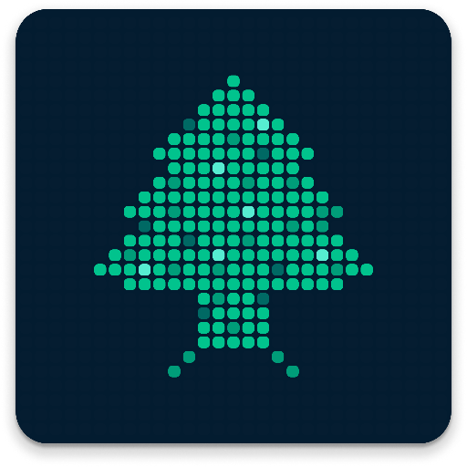

# Develeb Full Stack App Template

<div align="center">
  <a href="https://github.com/DeveLeb/nextjs-supabase-template">
    
  </a>
  <h3 align="center">Develeb Full Stack App Template</h3>
  <p align="center">
    Built with Next.js, Supabase, and deployed on Vercel & Google Cloud.
    <br />
    <a href="https://github.com/DeveLeb/nextjs-supabase-template">View Project</a>
    ·
    <a href="https://github.com/DeveLeb/nextjs-supabase-template/issues/new?labels=bug">Report Bug</a>
    ·
    <a href="https://github.com/DeveLeb/nextjs-supabase-template/issues/new?labels=enhancement">Request Feature</a>
  </p>
</div>

## About The Project

This template provides a production-ready setup for full-stack applications using Next.js and Supabase.

### Built With

- [Next.js](https://nextjs.org/)
- [Supabase](https://supabase.com/)
- [Tailwind CSS](https://tailwindcss.com/)

## Getting Started

Follow these steps to set up and run the project locally.

### Prerequisites

- [Supabase Account](https://supabase.com/dashboard/sign-up)
- Node.js 18.18 or later
- [Vercel Account](https://vercel.com/signup)

### Installation

1. Create a Supabase project via the [Supabase dashboard](https://database.new)
2. Clone the repository:
   ```bash
   git clone https://github.com/DeveLeb/nextjs-supabase-template.git
   ```
3. Navigate to the project directory:
   ```bash
   cd nextjs-supabase-template
   ```
4. Rename `.env.example` to `.env.local` and update:
   ```env
   SUPABASE_URL=[INSERT SUPABASE PROJECT URL]
   SUPABASE_ANON_KEY=[INSERT SUPABASE ANON KEY]
   ```
   Find these in your [Supabase project API settings](https://app.supabase.com/project/_/settings/api).
5. Install dependencies and start the development server:
   ```bash
   npm install
   npm run dev
   ```
   The app should now be running at [localhost:3000](http://localhost:3000/).
6. To customize the UI, delete `components.json` and follow the [shadcn/ui installation guide](https://ui.shadcn.com/docs/installation/next).

## Deploying to Vercel

This Next.js application can be deployed seamlessly to Vercel. To deploy:

1. **Connect Your Repository:** Log in to [Vercel](https://vercel.com/) and import your GitHub repository.
2. **Configure Environment Variables:** In your Vercel project settings, add the following environment variables:
   - `SUPABASE_URL`
   - `SUPABASE_ANON_KEY`
3. **Deploy:** Vercel will automatically build and deploy your application. For more details, refer to the [Vercel Documentation for Next.js](https://vercel.com/docs/concepts/frameworks/next.js).

## Contributing

We welcome contributions! To contribute:

1. Fork the repository
2. Create a feature branch (`git checkout -b feature/new-feature`)
3. Commit changes (`git commit -m 'Add new feature'`)
4. Push to your branch (`git push origin feature/new-feature`)
5. Open a pull request

## License

Distributed under the MIT License. See `LICENSE.txt` for details.

## Contact

For inquiries, visit our [GitHub repository](https://github.com/DeveLeb/nextjs-supabase-template) or connect on [LinkedIn](https://www.linkedin.com/company/develeb/).
